## Hi there, Nice to see you
I'm Anoop Singh Tomar

## 🌐 Socials:
  

# 💻 Tech Stack:
        
# 📊 GitHub Stats:

| Statstics | Languages |
|----------|-----------|
|  |  |

<!-- Streak Stats (this stays external – correct as-is) -->

### 📊 GitHub Activity Overview

### 🧠 Most Used Languages

---

  

